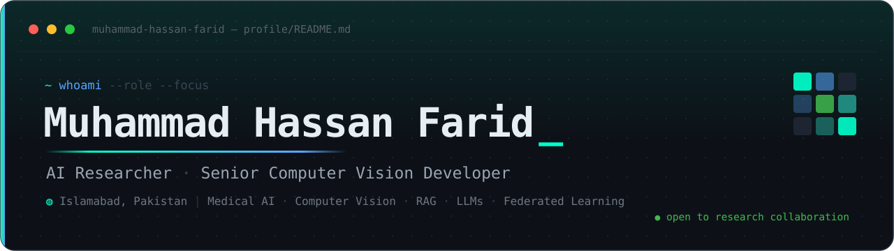
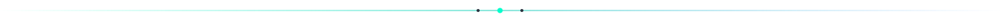
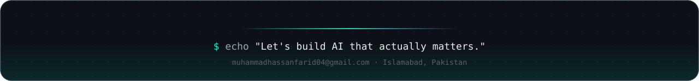

<!-- ════════════════════════════════════════════════════════════════ -->
<!-- 1 · HEADER BANNER                                                  -->
<!-- ════════════════════════════════════════════════════════════════ -->

<div align="center">



<!-- ════════════════════════════════════════════════════════════════ -->
<!-- 2 · ANIMATED TYPING SUBLINE                                        -->
<!-- ════════════════════════════════════════════════════════════════ -->

<a href="https://github.com/Muhammad-Hassan-Farid">
  
</a>

<!-- ════════════════════════════════════════════════════════════════ -->
<!-- 3 · SOCIAL & STATUS BADGES                                         -->
<!-- ════════════════════════════════════════════════════════════════ -->

<p>
  <a href="https://github.com/Muhammad-Hassan-Farid"></a>
  <a href="https://www.linkedin.com/in/muhammad-hassan-farid"></a>
  <a href="https://www.kaggle.com/hassanfarid004"></a>
  <a href="https://orcid.org/0009-0000-0177-5869"></a>
  <a href="mailto:muhammadhassanfarid04@gmail.com"></a>
</p>

<p>
  
  
</p>

</div>

<!-- ════════════════════════════════════════════════════════════════ -->
<!-- 4 · WHO AM I                                                       -->
<!-- ════════════════════════════════════════════════════════════════ -->

```python
class MuhammadHassanFarid:
    def __init__(self):
        self.role        = "AI Researcher · Senior Computer Vision Developer"
        self.location    = "Islamabad, Pakistan 🇵🇰"
        self.education   = {
            "MS Artificial Intelligence": "COMSATS University (2024 – Present)",
            "BS Computer Science":        "Hamdard University (2020 – 2024)",
        }
        self.research_interests = [
            "Computer Vision", "Medical AI", "LLMs", "RAG",
            "Agentic AI", "Federated Learning",
        ]
        self.current_focus = "Diagnostic vision models + production-grade LLM systems"
        self.open_to       = ["Research collaboration", "CV/ML consulting", "Co-authoring"]

    def say_hi(self):
        return "Let's build AI that actually matters."
```

<div align="center"></div>

<!-- ════════════════════════════════════════════════════════════════ -->
<!-- 5 · ABOUT ME                                                       -->
<!-- ════════════════════════════════════════════════════════════════ -->

## `01` · About Me

> I build computer-vision and language systems that move from the notebook to the clinic and the production server. My work sits where peer-reviewed research meets shipped software — medical imaging, diagnostics, and applied LLM tooling. I care about models that earn trust, not just leaderboard scores.

| Area | Focus |
| :--- | :--- |
| 🔬 **Research** | Medical AI, Federated Learning, NLP |
| 👁️ **Vision** | Detection, Segmentation, Tracking |
| 🤖 **LLMs** | RAG, Agentic AI, LangChain, OpenAI |
| 🏥 **Healthcare AI** | MRI, CT Scan, Skin/Lung Cancer Diagnostics |

<div align="center"></div>

<!-- ════════════════════════════════════════════════════════════════ -->
<!-- 6 · EXPERIENCE TIMELINE                                            -->
<!-- ════════════════════════════════════════════════════════════════ -->

## `02` · Experience

```text
Apr 2026 ─ Now        ● Co-Founder & Chief AI Officer
                        Tech Prime Pvt. Ltd.  ·  Remote

Mar 2026 ─ Now        ● Senior Computer Vision Developer
                        Visual Computing Technologies  ·  Remote

Nov 2024 ─ Now        ● Lab Engineer
                        Abasyn University Islamabad

Feb 2025 ─ Feb 2026   ○ Research & Development Engineer
                        UTech Innovative Solutions  ·  Hong Kong

May 2024 ─ Jun 2024   ○ Data Scientist & Analyst II
                        Prodigy InfoTech
```

<div align="center"></div>

<!-- ════════════════════════════════════════════════════════════════ -->
<!-- 7 · PUBLICATIONS                                                   -->
<!-- ════════════════════════════════════════════════════════════════ -->

## `03` · Publications

<table>
<tr>
<td valign="top" align="center"></td>
<td valign="top">

**Human Capital and Well-Being Meter Based on Federated Learning Powered Sentiment Analysis**
Shaheer, Nazar, Arooj, **Hassan Farid**, et al.
*International Journal of Social Sciences Bulletin*
DOI: [10.5281/zenodo.18513303](https://doi.org/10.5281/zenodo.18513303)

</td>
</tr>
<tr>
<td valign="top" align="center"></td>
<td valign="top">

**Enhancing Conventional CNNs with Compound Scaling for Brain Tumor Detection in MRI**
**Hassan Farid**, Nasim, Umar, Javed
*ESMRMB 2025 · Marseille, France · Oct 8–11, 2025*
DOI: [10.1007/s10334-025-01278-8](https://doi.org/10.1007/s10334-025-01278-8)

</td>
</tr>
</table>

<div align="center"></div>

<!-- ════════════════════════════════════════════════════════════════ -->
<!-- 8 · TECH STACK                                                     -->
<!-- ════════════════════════════════════════════════════════════════ -->

## `04` · Tech Stack

<table>
<tr>
<td><b>Languages</b></td>
<td>


</td>
</tr>
<tr>
<td><b>Deep Learning&nbsp;&amp;&nbsp;AI</b></td>
<td>


</td>
</tr>
<tr>
<td><b>Computer Vision</b></td>
<td>


</td>
</tr>
<tr>
<td><b>LLMs&nbsp;&amp;&nbsp;NLP</b></td>
<td>


</td>
</tr>
<tr>
<td><b>MLOps&nbsp;&amp;&nbsp;Deploy</b></td>
<td>


</td>
</tr>
<tr>
<td><b>Data&nbsp;&amp;&nbsp;Viz</b></td>
<td>


</td>
</tr>
</table>

<div align="center"></div>

<!-- ════════════════════════════════════════════════════════════════ -->
<!-- 9 · FEATURED PROJECTS                                              -->
<!-- ════════════════════════════════════════════════════════════════ -->

## `05` · Featured Projects

| | Project | Description | Stack | Link |
| :---: | :--- | :--- | :--- | :---: |
| 🩺 | **Medi** | LLM-powered medical assistant for clinical Q&A and triage | LangChain · OpenAI · RAG | [Repo](https://github.com/Muhammad-Hassan-Farid/Medi) |
| 🫁 | **Lung Tumor U-Net** | Volumetric lung-tumor segmentation on CT scans | PyTorch · U-Net · MONAI | [Repo](https://github.com/Muhammad-Hassan-Farid/Lung-Tumor-Segmentation-With-UNET) |
| 🔬 | **Lung Cancer FYP** | End-to-end ML pipeline for lung-cancer detection (final-year project) | Scikit-Learn · Pandas · Flask | [Repo](https://github.com/Muhammad-Hassan-Farid/LUNG-CANCER-DETECTION-USING-MACHINE-LEARNING-FYP) |
| 🧴 | **MelanoDetect AI** | Skin-lesion / melanoma classification from dermoscopic images | TensorFlow · Keras · CNN | [Repo](https://github.com/Muhammad-Hassan-Farid?tab=repositories) |
| 🏷️ | **BERT NER** | Named-entity recognition fine-tuned on transformer embeddings | Hugging Face · BERT · PyTorch | [Repo](https://github.com/Muhammad-Hassan-Farid?tab=repositories) |
| ♻️ | **YOLOv8 Waste Recycling** | Real-time waste sorting for a recycling plant | YOLOv8 · OpenCV · Ultralytics | [Repo](https://github.com/Muhammad-Hassan-Farid/YoloV8n-for-Wast-Recycle-Plant) |
| 🧘 | **Posture Tracking** | Live posture analysis API with pose landmarks | MediaPipe · Django REST | [Repo](https://github.com/Muhammad-Hassan-Farid?tab=repositories) |
| 🛡️ | **Web-Based IDS** | Intrusion-detection system with ML traffic classification | Python · Scikit-Learn · Flask | [Repo](https://github.com/Muhammad-Hassan-Farid?tab=repositories) |
| 📊 | **Credit Card Financial Dashboard** | Interactive financial analytics dashboard | Power BI · SQL · DAX | [Repo](https://github.com/Muhammad-Hassan-Farid?tab=repositories) |

<div align="center"></div>

<!-- ════════════════════════════════════════════════════════════════ -->
<!-- 10 · GITHUB STATS                                                  -->
<!-- ════════════════════════════════════════════════════════════════ -->

## `06` · GitHub Stats

<div align="center">


<br/>


<br/>


</div>

<div align="center"></div>

<!-- ════════════════════════════════════════════════════════════════ -->
<!-- 11 · CONTRIBUTION SNAKE                                            -->
<!-- ════════════════════════════════════════════════════════════════ -->

## `07` · Contribution Graph

<div align="center">

<picture>
  <source media="(prefers-color-scheme: dark)" srcset="https://raw.githubusercontent.com/Muhammad-Hassan-Farid/Muhammad-Hassan-Farid/output/github-contribution-grid-snake-dark.svg" />
  <source media="(prefers-color-scheme: light)" srcset="https://raw.githubusercontent.com/Muhammad-Hassan-Farid/Muhammad-Hassan-Farid/output/github-contribution-grid-snake.svg" />
  
</picture>

</div>

> **Enable the snake** — create `.github/workflows/snake.yml` in this repo and paste:
>
> ```yaml
> name: Generate Snake Animation
>
> on:
>   schedule:
>     - cron: "0 */12 * * *"   # every 12 hours
>   workflow_dispatch:
>   push:
>     branches: [main]
>
> permissions:
>   contents: write
>
> jobs:
>   generate:
>     runs-on: ubuntu-latest
>     steps:
>       - name: Generate snake SVGs
>         uses: Platane/snk@v3
>         with:
>           github_user_name: ${{ github.repository_owner }}
>           outputs: |
>             dist/github-contribution-grid-snake.svg
>             dist/github-contribution-grid-snake-dark.svg?palette=github-dark
>
>       - name: Push to output branch
>         uses: crazy-max/ghaction-github-pages@v4
>         with:
>           target_branch: output
>           build_dir: dist
>         env:
>           GITHUB_TOKEN: ${{ secrets.GITHUB_TOKEN }}
> ```

<div align="center"></div>

<!-- ════════════════════════════════════════════════════════════════ -->
<!-- 12 · HONORS & CERTIFICATIONS                                       -->
<!-- ════════════════════════════════════════════════════════════════ -->

## `08` · Honors & Certifications

<table>
<tr>
<td valign="top" width="50%">

### 🥇 Awards

- **INNOVATE PAKISTAN × DevQuest** — AI Automation & Agentic AI · *2026*
- **IEEE Islamabad CIS Industry Gala** — Organizer · *2023*
- **VISIO SPARK Coding Competition** — Top 9th · *2023*

</td>
<td valign="top" width="50%">

### 📜 Certifications

- **OpenCV Bootcamp (100%)** — OpenCV University · *2026*
- **Intro to Prompt Engineering** — SimpleLearn SkillUP · *2025*
- **Python Essential 1** — CISCO · *2024*
- **Python for Machine Learning** — Udemy · *2023*
- **Data Analysis Using Python** — 10 Pearls University · *2023*
- **SQL (Intermediate)** — HackerRank · *2023*
- **Google Data Analytics (Professional)** — Coursera / Google · *2022*

</td>
</tr>
</table>

<div align="center"></div>

<!-- ════════════════════════════════════════════════════════════════ -->
<!-- 13 · CLOSING QUOTE                                                 -->
<!-- ════════════════════════════════════════════════════════════════ -->

<div align="center">

> ### *"Data is the new oil — but only valuable when refined into insight."*
>
> **— Muhammad Hassan Farid**

</div>

<!-- ════════════════════════════════════════════════════════════════ -->
<!-- 14 · FOOTER                                                        -->
<!-- ════════════════════════════════════════════════════════════════ -->

<div align="center">



</div>
